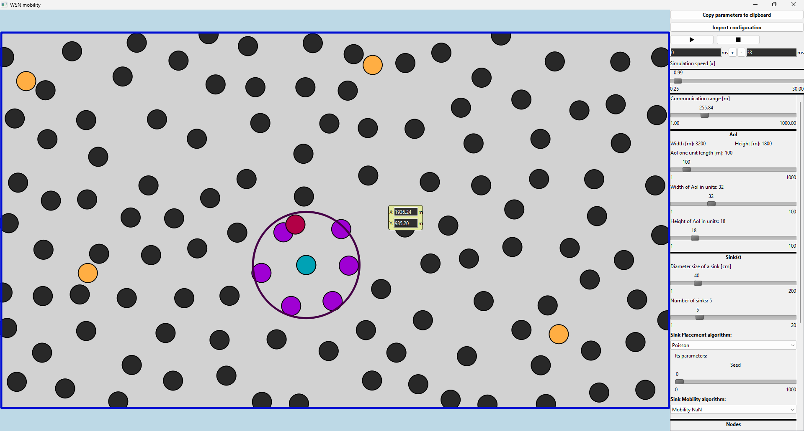

# Millisecond resolution WSN simulator

Wireless Sensor Network (WSN) simulator software package including WSN simulator and WSN mobility simulator.

A screenshot of the WSN mobility simulator:


Built with the Qt framework.

Acknowledgement to Tommy Hinks for the implemented Poisson-disk sampling algorithm which I used as a sink and node placement algorithm in certain softwares of this repo:

[https://github.com/thinks/poisson-disk-sampling](https://github.com/thinks/poisson-disk-sampling)

## Build from source

### The WSN mobility software

After cloning this repo, the WSN mobility software can be compiled by installing Qt, and then building by Qt Creator or running the following command in the ```WSN_mobility``` directory:

```cmake.exe --build /target/build/directory --target all```

### The WSN simulation software

The "the_simulation" software can be compiled by running the following command:

```the_simulation/HPC_compile_all_things.bash /path/to/the/the_simulation/```

## Using a prebuilt binary of the WSN mobility software

See the [releases page](https://github.com/peterpolgar/WSN_simulator/releases).

## Usage

The usage of the WSN mobility software is self-explanatory by the GUI (I think).

The usage of the WSN simulation software is described in the ```the_simulation/run_usage.txt``` file.

You can find example configuration files (.conf) in the ```the_simulation``` folder.
